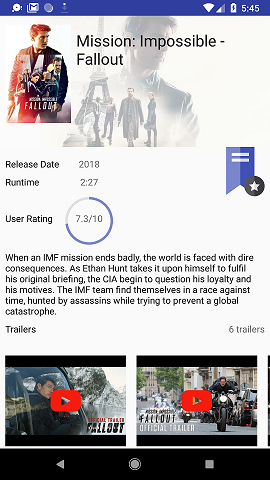
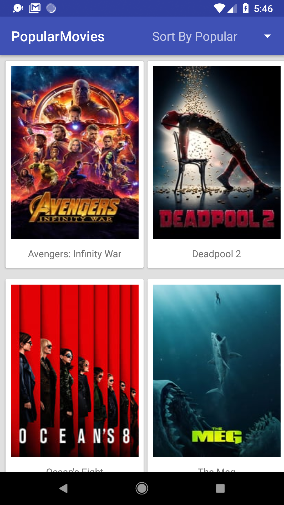

This project is part of Udacity AND Nanodegree program

# Screenshots

To run the project, please provide your api-key form https://www.themoviedb.org/ and create
a new file named secret.properties in the root folder then past your key as following:
`API_KEY=xxxxxxxxxx`